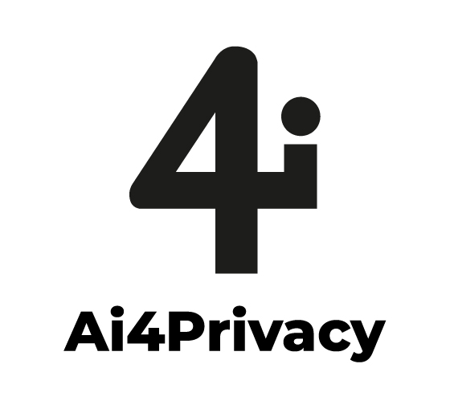

<p align="center">
  
</p>

<h1 align="center">ai4privacy</h1>

<p align="center">
  A Python package for state-of-the-art PII detection, masking, and reidentification using advanced transformer models.
</p>

<p align="center">
  <a href="https://pypi.org/project/ai4privacy/">
    
  </a>
  <a href="https://pypi.org/project/ai4privacy/">
    
  </a>
</p>

---

## Overview

ai4privacy provides three core modes for working with personally identifiable information (PII):

| Mode | Function | Description |
|------|----------|-------------|
| **Protect** | `protect()` / `batch_protect()` | Mask PII with `[PII_N]` placeholders |
| **Observe** | `observe()` | Analyze text for PII without modifying it |
| **Reidentify** | `reidentify()` / `batch_reidentify()` | Restore original text from masked output |

---

## Features

- **Protect Mode** -- Anonymize text by replacing detected PII with placeholders.
- **Observe Mode** -- Get statistics and a detailed privacy mask of found PII without altering the original text.
- **Reidentify Mode** -- Restore masked text back to its original form using the replacement map.
- **Multiple Models** -- Built-in support for English, multilingual, and categorical PII detection.
- **Batch Processing** -- Efficiently process multiple texts at once with `batch_protect()` and `batch_reidentify()`.
- **Tunable Sensitivity** -- Adjustable `score_threshold` to balance detection accuracy with false positives.
- **Verbose & Developer Modes** -- Rich outputs for detailed analysis and debugging.

---

## Installation

```bash
pip install ai4privacy
```

---

## Quick Start

### Protect -- Mask PII

The simplest way to use the library is to call `protect()`, which masks PII with placeholders.

```python
from ai4privacy import protect

text = "Email me at developers@ai4privacy.com or call me at +41794567890."
masked_text = protect(text)

print(masked_text)
# Output: Email me at [PII_1] or call me at [PII_2]
```

### Observe -- Analyze PII

Use `observe()` to analyze text without changing it. It returns statistics and a detailed privacy mask.

```python
from ai4privacy import observe
import json

text = "My name is Alice and I live in Berlin."
report = observe(text, classify_pii=True)

print(json.dumps(report, indent=2))
```

```json
{
  "num_texts_processed": 1,
  "num_texts_with_pii": 1,
  "pii_entity_counts": {
    "GIVENNAME": 1,
    "CITY": 1
  },
  "total_pii_entities_found": 2,
  "privacy_mask": [
    {
      "label": "GIVENNAME",
      "start": 11,
      "end": 16,
      "activation": 0.98,
      "value": "Alice"
    },
    {
      "label": "CITY",
      "start": 30,
      "end": 36,
      "activation": 0.99,
      "value": "Berlin"
    }
  ]
}
```

### Reidentify -- Restore Original Text

Use `reidentify()` to reverse the masking and recover the original text.

```python
from ai4privacy import protect, reidentify

# Step 1: Mask text (with verbose=True to get the replacement map)
result = protect("My email is alice@example.com", verbose=True)
print(result["masked_text"])
# Output: My email is [PII_1]

# Step 2: Restore original text
restored = reidentify(result["masked_text"], result["replacements"])
print(restored)
# Output: My email is alice@example.com
```

---

## Models

Three pre-trained transformer models are available, selectable via function flags:

| Flag | Model | Use Case |
|------|-------|----------|
| *(default)* | `ai4privacy/llama-ai4privacy-english-anonymiser-openpii` | English-only PII detection |
| `multilingual=True` | `ai4privacy/llama-ai4privacy-multilingual-anonymiser-openpii` | Multi-language support |
| `classify_pii=True` | `ai4privacy/llama-ai4privacy-multilingual-categorical-anonymiser-openpii` | Fine-grained PII categories (GIVENNAME, SURNAME, EMAIL, CITY, etc.) |

```python
from ai4privacy import protect

text = "Je m'appelle Pierre et j'habite a Paris."

# Multilingual model for non-English text
masked = protect(text, multilingual=True)
print(masked)
# Output: Je m'appelle [PII_1] et j'habite a [PII_2]

# Categorical model to see PII types
details = protect(text, classify_pii=True, verbose=True)
print([r['label'] for r in details['replacements']])
# Output: ['GIVENNAME', 'CITY']
```

---

## Batch Processing

Process multiple texts efficiently using `batch_protect()` and `batch_reidentify()`.

```python
from ai4privacy import batch_protect, batch_reidentify

texts = [
    "Email: alice@example.com",
    "Call me at +41794567890",
    "My name is Pierre Dupont"
]

# Mask all texts
results = batch_protect(texts, verbose=True, classify_pii=True)

for r in results:
    print(r["masked_text"])

# Restore all texts
restored = batch_reidentify(results)
print(restored)
```

---

## Advanced Usage

### Verbose and Developer Modes

Set `verbose=True` to get a dictionary containing the original text, masked text, and replacement details. For deep debugging, `developer_verbose=True` adds a token-by-token breakdown of the model's predictions.

```python
from ai4privacy import protect

text = "Senden Sie es an Eva Schmidt."
details = protect(text, classify_pii=True, verbose=True)

print(details['replacements'])
# Output: [{'label': 'GIVENNAME', 'start': 18, 'end': 22, ...}, {'label': 'SURNAME', 'start': 23, 'end': 30, ...}]
```

### Adjusting Sensitivity

The `score_threshold` (default: `0.01`) controls how confident the model must be to flag a token as PII.

- A **lower** value increases sensitivity (finds more PII, but may have more false positives).
- A **higher** value increases precision (detections are more likely correct, but may miss some PII).

```python
from ai4privacy import protect

text = "Maybe this is a name, maybe not. Contact John."

# High precision
masked = protect(text, score_threshold=0.5)
print(f"High Precision: {masked}")
# Output: High Precision: Maybe this is a name, maybe not. Contact [PII_1]

# High sensitivity
masked = protect(text, score_threshold=0.001)
print(f"High Sensitivity: {masked}")
```

---

## API Reference

### `protect(text, verbose=False, score_threshold=0.01, multilingual=False, classify_pii=False, developer_verbose=False)`

Mask PII in a single text string. Returns a masked string by default, or a dictionary with details when `verbose=True`.

### `batch_protect(texts, verbose=False, score_threshold=0.01, batch_size=32, multilingual=False, classify_pii=False, developer_verbose=False)`

Mask PII in a list of texts. Returns a list of results.

### `observe(texts, score_threshold=0.01, batch_size=32, multilingual=False, classify_pii=False, developer_verbose=False)`

Analyze text(s) for PII without modification. Returns statistics and a privacy mask.

### `reidentify(masked_text, replacements)`

Restore a masked text to its original form using the replacements list from `protect(verbose=True)`.

### `batch_reidentify(results)`

Restore a list of masked results. Each item must have `masked_text` and `replacements` keys.

---

## Disclaimer

Ai4Privacy is trained on the world's largest open-source privacy dataset. For production use, please evaluate results carefully on your own datasets. For assistance, contact us at [ai4privacy.com](https://ai4privacy.com) or email support@ai4privacy.com.
